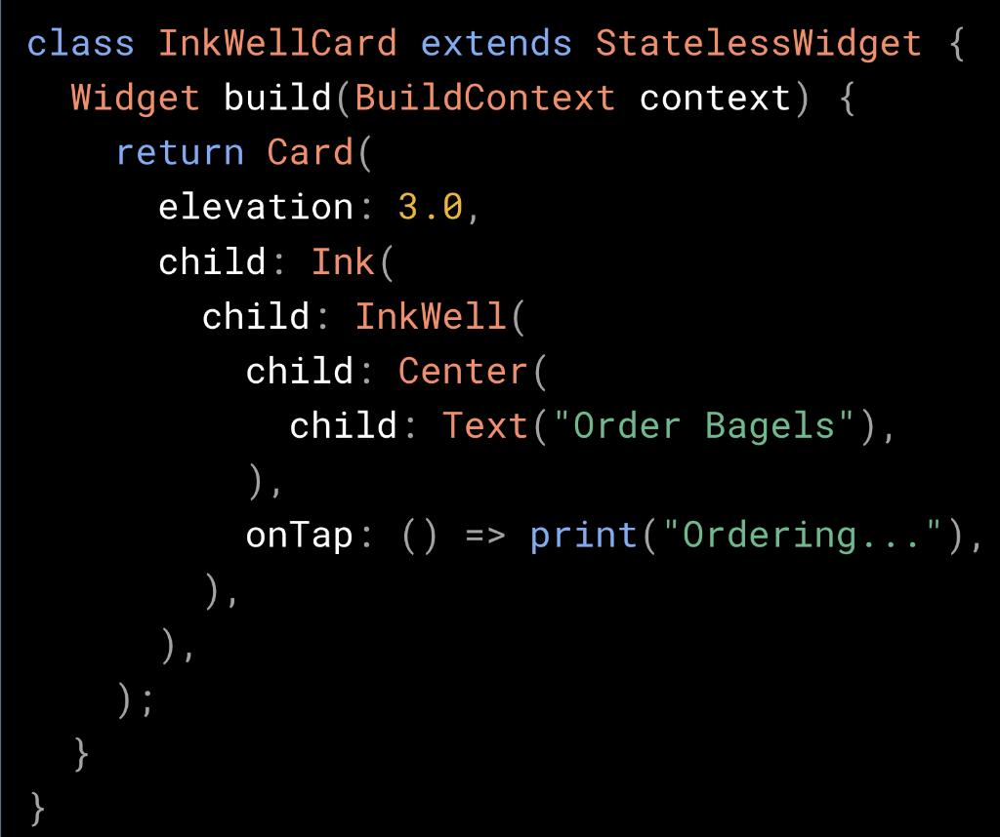
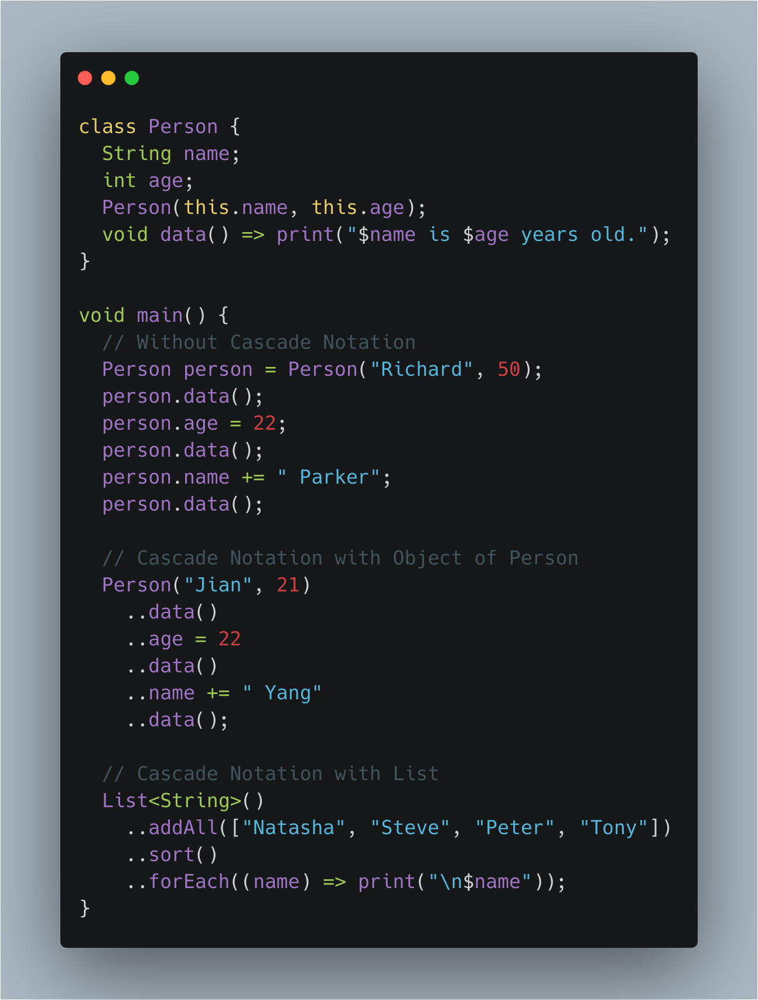
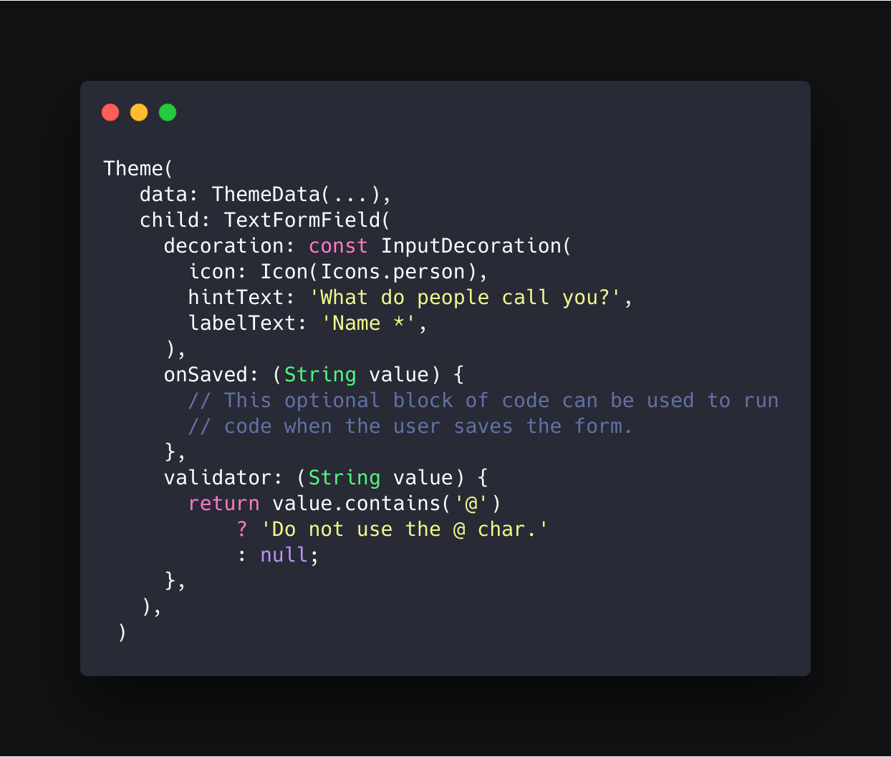
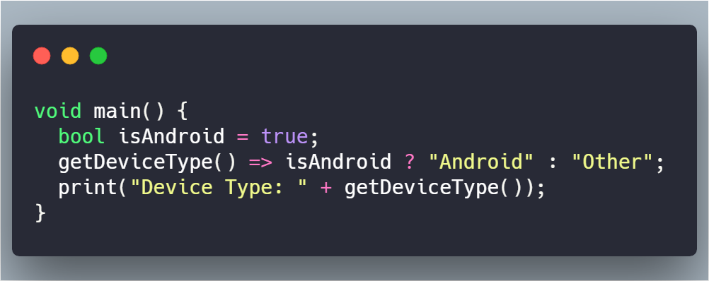
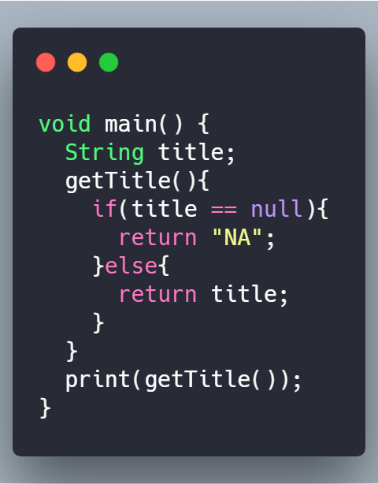
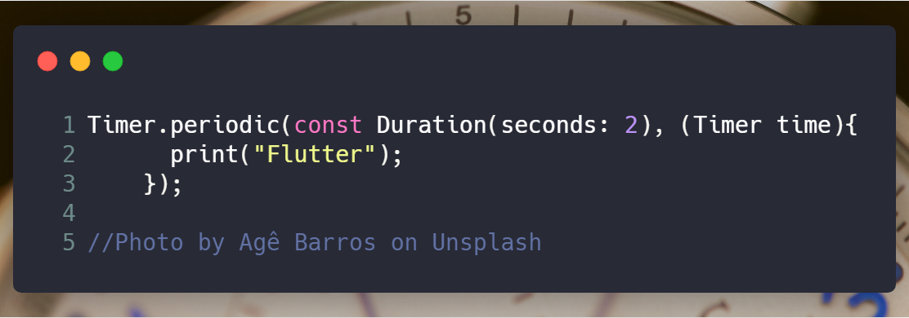
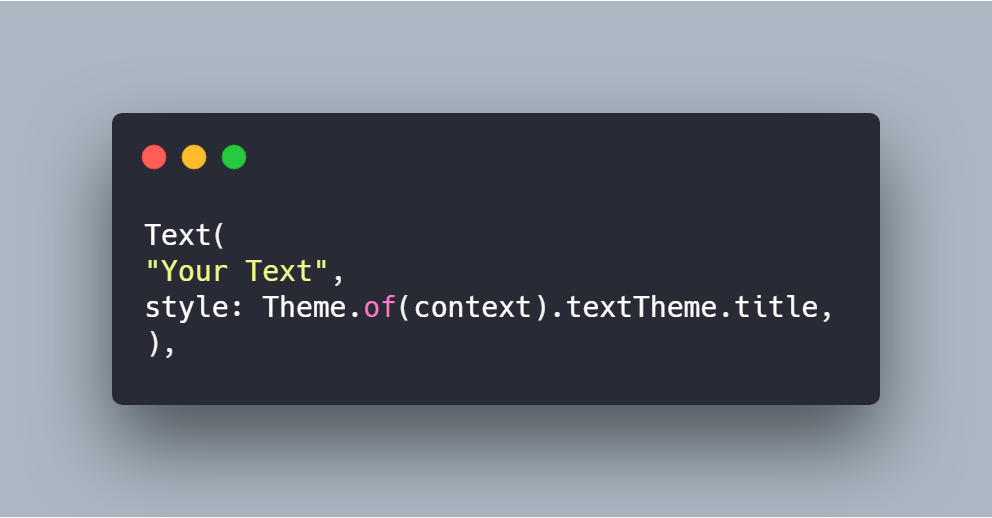
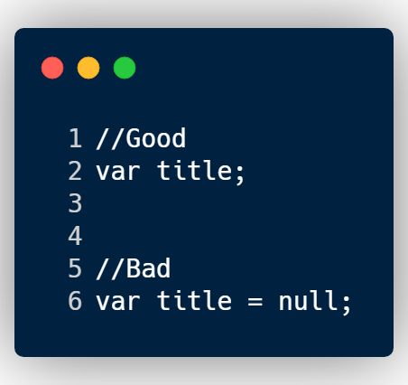
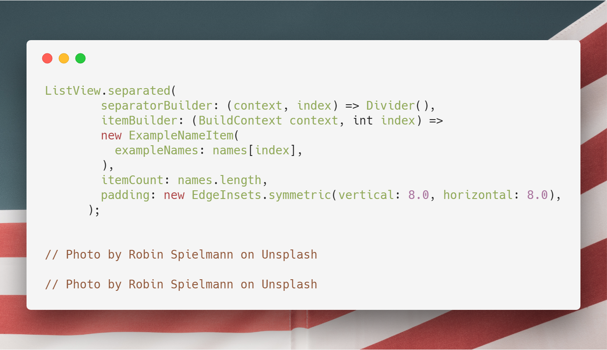
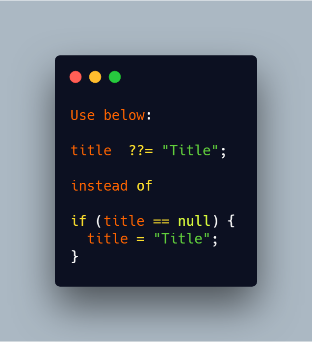

### 14. Check if debug mode or not
You can use `assert()` method to check if the code is running in debugg mode or not. 
`assert()` method only excecute in debugg mode.

```Dart
bool isDebugMode = false;

assert(isDebugMode = true);

// Or you can do like this
assert((){
  isDebugMode = true
}());

print('Is Debug Mode: $isDebugMode');
```

### 13. Prefer single quotes for strings
Use double quotes for nested strings or (optionally) for strings that contain single quotes. For all other strings, use single quotes.

```Dart
final String name = 'Flutter And Dart Tips';

print('Hello ${name.split(" ")[0]}');
print('Hello ${name.split(" ")[2]}');

```

### 12. Implement `assert()` messages in Dart.

Do you know that you can throw your own message when your `assert` fails?
`assert()` takes an optional message in which you can pass your message.

```Dart
assert(title != null, "Title string cannot be null.");
```

### 11. Using Plurals in your Dart String.

**Plurals:** Different languages have different rules for grammatical agreement with quantity. In English, for example, the quantity 1 is a special case. We write "1 book", but for any other quantity we'd write "n books". This distinction between singular and plural is very common, but other languages make finer distinctions.

You can use Plurals in your Dart string by using [`Intl`](https://pub.dev/packages/intl) package. The full set supported by `Intl` package is zero, one, two, few, many, and other.

- Add dependency:

```Dart
dependencies:
  intl: version
```

- How to use:

```dart
import 'package:intl/intl.dart';
...
notificationCount(int howMany) => Intl.plural(
      howMany,
      zero: 'You don\'t have any notification.',
      one: 'You have $howMany notification.',
      other: 'You have $howMany notifications.',
      name: "notification",
      args: [howMany],
      examples: const {'howMany': 42},
      desc: "How many notifications are there.",
    );

    print(notificationCount(0));
    print(notificationCount(1));
    print(notificationCount(2));
    
```

- Output:

```Outout
You don't have any notification.
You have 1 notification.
There are 2 notifications.
```

### 10. Having trouble displaying splashes using an InkWell?
Use an Ink widget! The Ink widget draws on the same widget that InkWell does, so the splash appears.
#FlutterFriday tweet by [Flutter.dev](https://twitter.com/FlutterDev/status/1121874600361693189?s=20).

Learn more [here](https://goo.gl/4cx2Kn).




### 9. Want to log data on the system console in Flutter?

You can use the `print()` function to view it in the system console.
If your output is too much, then Android sometimes discards some log lines.
To avoid this, you can use `debugPrint()`.

You can also log your print calls to disk if your doing long-term or background work.

Check out this [Gist](https://gist.github.com/slightfoot/1770dec7967def3b4d021bba8d814817) by [Simon Lightfoot](https://github.com/slightfoot)

### 8. Cascade Notation - Method Chaining on Steroids :pill::syringe:
`Cascades Notation (..)` allows to chain a sequence of operations on same object. In addition, fields (data-memebers) can be accessed using the same.

[Open in DartPad :dart:](https://dartpad.dartlang.org/a93316aa779a2e0dd1993ae9a3464731)



### 7. Want to set different Theme for a perticular widget ?

Just wrap the widget with the `Theme` Widget and pass the `ThemeData()`.



## Monthly Tip Article (February 2019)

This article contains the Tips from February month that shared over here.

[#2 Flutter + Dart Tips](https://medium.com/flutter-community/2-flutter-dart-tips-f149ffe83381)

### 6. Use Ternary operator instead of the if else to shorter your Dart code.

Use below.



Instead of this.



### 5. Want to run task periodically in Dart?

What about using `Timer.periodic`
It will create a repeating timer, It will take a two argument one is `duration` and second is `callback` that must take a one Timer parameter.



You can cancle the timer using the `timer.cancel()`.

### 4. Apply style as a Theme in a `Text` widget.
Check out below article for detail information about this tip.
[Apply style as a Theme in a `Text` widget](https://medium.com/flutter-community/flutter-apply-style-as-a-theme-in-a-text-widget-90268328bd23)



## Monthly Tip Article (January 2019)

This article contains the Tips from January month that shared over here.

[#1 Flutter + Dart Tips](https://medium.com/flutter-community/1-flutter-dart-tips-830854c3a418)


### 3. Do not explicitly initialize variables to `null`.

Adding `= null` is redundant and unneeded.



### 2. Using `ListView.separated()`
Want to add the separator in your Flutter ListView?

Go for the
`ListView.separated();`

Best part about seprated is it can be any widget.😃

Check out the below image for the sample code.



### 1. Using `null-aware operators`
While checking the null in the Dart, Use `null-aware operators` help you reduce the amount of code required to work with references that are potentially null.


